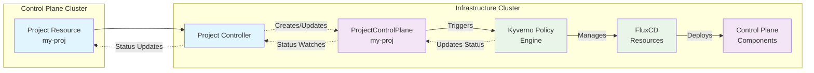
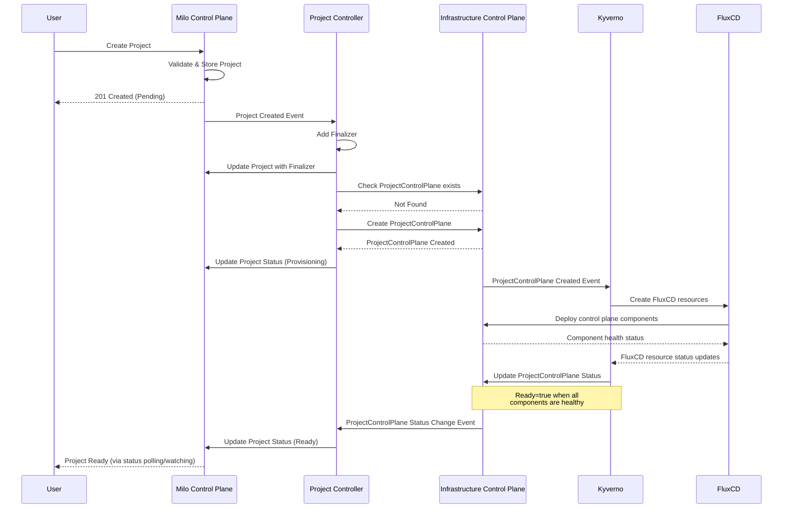
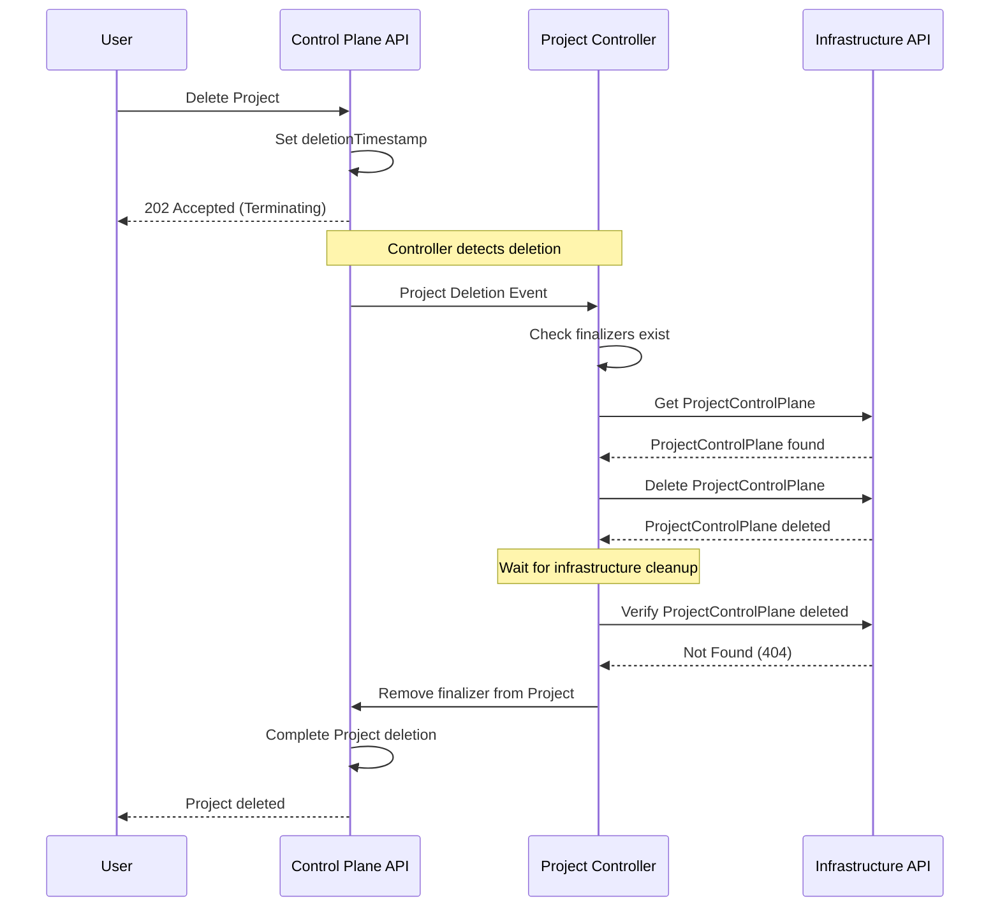

# Project Controller

## Overview

The Project Controller is a custom Kubernetes controller responsible for
managing the lifecycle of `Project` resources and their corresponding
`ProjectControlPlane` resources across multiple Kubernetes clusters. This
controller implements a cross-cluster resource management pattern where projects
are defined in a control plane cluster and provisioned in a separate
infrastructure cluster.

## Architecture

## Resource Definitions

### Project Resource

The `Project` resource is a cluster-scoped custom resource that represents a
business project in the Milo system with owner references and readiness status
conditions.

### ProjectControlPlane Resource

The `ProjectControlPlane` resource is created in the infrastructure cluster and
represents the actual infrastructure provisioned for the project, including
project name labels and owner annotations for cross-cluster tracking.

## Controller Behavior

### Reconciliation Loop

The Project Controller follows the standard Kubernetes controller pattern with
the following reconciliation logic:

1. **Fetch Project**: Retrieve the `Project` resource from the control plane
   cluster
2. **Handle Finalizers**: Process deletion and cleanup if the project is being
   deleted
3. **Check Readiness**: Skip reconciliation if the project is already in a ready
   state
4. **Provision Infrastructure**: Create or update the `ProjectControlPlane` in
   the infrastructure cluster
5. **Status Synchronization**: Update the `Project` status based on the
   `ProjectControlPlane` status

### Cross-Cluster Communication

#### Infrastructure Cluster Client

The controller maintains a separate Kubernetes client for the infrastructure
cluster with distinct clients for Project resources and ProjectControlPlane
resources.

#### Configuration

The infrastructure cluster client is configured via command-line flags to
specify the kubeconfig path for the infrastructure cluster.

### Infrastructure Deployment Architecture

The infrastructure cluster uses a GitOps-based approach for deploying the
project control plane components. Kyverno is responsible for orchestrating the
deployment of the control plane components by using FluxCD resources to manage
the deployments. This approach allows for a declarative and version-controlled
way to deploy the control plane components.

#### Kyverno Policy Engine

Kyverno acts as the orchestration layer in the infrastructure cluster:

- **Resource Watching**: Monitors `ProjectControlPlane` resources for
  creation/updates
- **Policy Execution**: Triggers policies that generate FluxCD resources
- **Status Management**: Watches FluxCD resource health and updates
  `ProjectControlPlane` status
- **Declarative Approach**: All infrastructure provisioning is defined as
  Kyverno policies

#### FluxCD GitOps

FluxCD manages the actual deployment of control plane components:

- **GitRepository**: References the infrastructure repository containing
  Kubernetes manifests
- **Kustomization**: Applies environment-specific configurations and patches
- **HelmRelease**: Deploys Helm charts for complex components (etcd, networking)
- **Health Monitoring**: Reports component status back to Kyverno

#### Control Plane Components

Each project gets its own isolated control plane consisting of:

- **Kubernetes APIServer**: Project-specific API server instance
- **Controllers**: Project-scoped controllers

### Resource Creation Flow

#### Resource Creation Steps

1. **Project Creation**: User creates a `Project` resource in the control plane
2. **Controller Detection**: Project Controller receives a reconcile event
3. **Infrastructure Check**: Controller checks if `ProjectControlPlane` exists
   in infrastructure cluster
4. **Resource Provisioning**: If not exists, controller creates
   `ProjectControlPlane` with:
   - Same name and namespace as the `Project`
   - Labels for cross-cluster identification
   - Annotations for ownership tracking
5. **Kyverno Policy Execution**: Kyverno watches `ProjectControlPlane` resources
   and triggers policies to:
   - Create FluxCD resources (GitRepository, Kustomization, HelmRelease)
   - Configure deployment parameters for the project's control plane
6. **FluxCD Deployment**: FluxCD resources deploy the actual control plane
   components:
   - Kubernetes APIServer instances
   - etcd clusters
   - Project-specific controllers
   - Networking and storage configurations
7. **Status Monitoring**: Kyverno monitors FluxCD resource status and updates
   `ProjectControlPlane` status
8. **Status Propagation**: Project Controller watches `ProjectControlPlane`
   status and updates `Project` status

### Deletion and Cleanup

#### Deletion Steps

The controller implements proper cleanup using Kubernetes finalizers:

1. **Finalizer Registration**: Adds finalizer to `Project` during creation
2. **Deletion Detection**: Detects when `Project` has `deletionTimestamp` set
3. **Infrastructure Cleanup**: Deletes corresponding `ProjectControlPlane` in
   infrastructure cluster
4. **Finalizer Removal**: Removes finalizer from `Project` to allow deletion

### Status Conditions

#### Project Status Conditions

- **Ready**: Indicates the project is fully provisioned and ready for use
  - `True`: Project and infrastructure are ready
  - `False`: Project is provisioning or has issues
  - `Unknown`: Initial state or waiting for infrastructure

#### Condition Reasons

- `Ready`: Project is fully operational
- `Provisioning`: Project is being created/updated
- `ProjectNameConflict`: Name already exists
- Infrastructure-specific reasons propagated from `ProjectControlPlane`

### Cross-Cluster Watching

The controller uses controller-runtime's cross-cluster watching capabilities to
monitor ProjectControlPlane resources in the infrastructure cluster and enqueue
reconciliation requests based on project name labels.

## Error Handling

### Common Error Scenarios

1. **Infrastructure Cluster Unavailable**: Controller logs errors and requeues
2. **Resource Conflicts**: Uses proper conflict resolution and retries
3. **Network Partitions**: Implements exponential backoff and recovery
4. **Namespace Deletion**: Handles graceful cleanup during namespace deletion

### Resilience Patterns

- **Exponential Backoff**: Failed operations are retried with increasing delays
- **Status Propagation**: Errors in infrastructure are reflected in project
  status
- **Graceful Degradation**: Controller continues operating even if some
  operations fail

## Configuration

### Required Permissions

#### Control Plane Cluster RBAC

Requires permissions for projects resources including full CRUD operations,
status updates, and finalizer management.

#### Infrastructure Cluster RBAC

Requires permissions for projectcontrolplanes resources including full CRUD
operations and status updates.

### Controller Manager Configuration

The Project Controller is integrated into the controller manager startup with
control plane and infrastructure cluster clients configured during
initialization.

## Monitoring and Observability

### Metrics

The controller exposes standard controller-runtime metrics:

- `controller_runtime_reconcile_total`: Total reconciliations
- `controller_runtime_reconcile_errors_total`: Failed reconciliations
- `controller_runtime_reconcile_time_seconds`: Reconciliation duration

### Logging

Structured logging is used throughout the controller for reconciliation events,
status updates, and error conditions.
