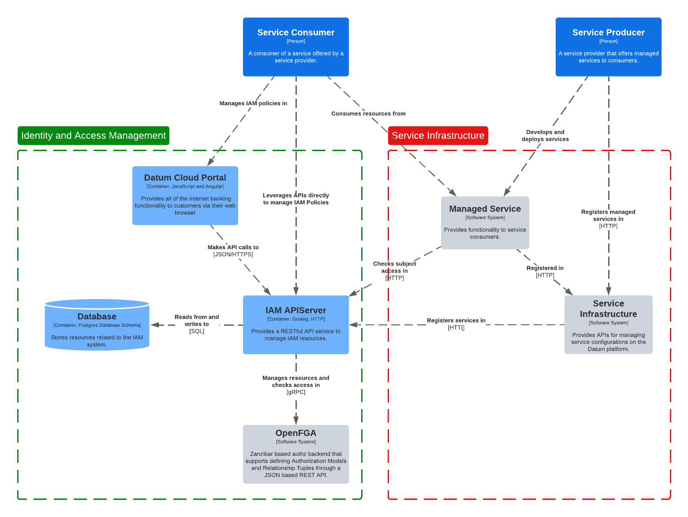

# Identity and Access Management

The Identity and Access Management (IAM) system provides the functionality
necessary for service producers and consumers to manage access to resources
created across the Datum Platform.

Review the [IAM enhancement document][iam-enhancement] for more information on the high-level
architecture and goals of this system.

[iam-enhancement]: https://github.com/datum-cloud/enhancements/tree/main/enhancements/business-os/identity-and-access-management

## Architecture

The IAM system is designed to support integrations with multiple backends. The
first integration is done with [OpenFGA] to support the existing authorization
backend used by Datum OS.

[OpenFGA]: https://openfga.dev

> [!IMPORTANT]
>
> We will soon be changing the IAM system to interact with a resource storage
> API to store it's resources instead of interacting with the database directly.
>
> Review the [resource storage enhancement][resource-storage] for more information.

[resource-storage]: https://github.com/datum-cloud/enhancements/issues/33

Managed services offered on the Datum Platform will be registered with the IAM
system to support managing access to resources provided by the service. Service
producers will manage roles in the IAM service that consumers can use to grant
permissions to resources provided by the service.

The IAM system will reconcile the [authorization model] and [relationship
tuples] in the OpenFGA backend based on Service Resources, Roles, and Policies
created for resources.

[authorization model]: https://openfga.dev/docs/concepts#what-is-an-authorization-model
[relationship tuples]: https://openfga.dev/docs/concepts#what-is-a-relationship-tuple

## Providers

The IAM system is built to eventually support multiple providers to allow
service providers to bring their own Authentication and Authorization systems.
The IAM system currently supports the following providers:

- **OpenFGA**: The IAM system will manage the authorization model and
  relationship tuples in OpenFGA based on roles and policies that are created.
  Read through the [OpenFGA integration](./providers/openfga.md) for more
  information.
