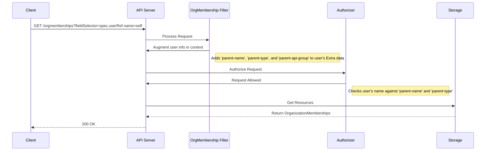

# Organization Memberships

## Overview

Organization memberships are a way to define the relationships between users and
organizations.

## Goals

- To provide a Kubernetes-native way to manage the relationship between users
  and organizations.
- To allow for querying all members of an organization.
- To allow for querying all organizations a user is a member of.
- The API should be consistent with the existing IAM and ResourceManager APIs.

## Non-Goals

- This enhancement does not cover permissions within an organization. It only
  establishes membership. Role definitions and their enforcement are out of
  scope for this specific enhancement.

## API

To represent the many-to-many relationship between `User` and `Organization`
resources, we will introduce a new `OrganizationMembership` custom resource.
This resource will be cluster-scoped.

### OrganizationMembership Resource

The `OrganizationMembership` resource will have the following structure:

```yaml
apiVersion: iam.miloapis.com/v1alpha1
kind: OrganizationMembership
metadata:
  name: <user-name>-<organization-name> # e.g. "scott-wells-datum-cloud"
spec:
  organizationRef:
    name: <organization-name>
  userRef:
    name: <user-name>
  roles:
  - member
  - admin
```

The `spec` contains:
- `organizationRef`: A reference to the `Organization` a user is a member of.
- `userRef`: A reference to the `User` who is the member.
- `roles`: A list of roles the user has in the organization.

The name of the `OrganizationMembership` resource should be a combination of the
user and organization name to ensure uniqueness.

### Usage

With this new resource, we can satisfy the requirements:

- **List all users in an organization:** One can list all
  `OrganizationMembership` resources and filter them by the
  `spec.organizationRef.name`.

- **List all organizations for a user:** One can list all
  `OrganizationMembership` resources and filter them by the `spec.userRef.name`.

This approach aligns with Kubernetes API conventions for representing
associations between resources.

## Authorization

Access to `OrganizationMembership` resources will be managed by a custom filter
within the API server's handler chain. This filter will inspect requests for
`OrganizationMembership` resources and, if a `fieldSelector` is present, it will
augment the user's authentication information. This extra context will then be
used by the authorizer to make a decision.

This approach is preferred over a webhook as it keeps the authorization logic
within the API server process, reducing external dependencies and potential
latency.

### Filter Logic

The filter will be placed in the handler chain before the authorization filter.
For any request to `organizationmemberships.iam.miloapis.com`, the filter will
perform the following steps:

1.  Extract the `RequestInfo` from the request context.
2.  Check if a `fieldSelector` is present in the request.
3.  Parse the `fieldSelector` to find `spec.userRef.name` or
    `spec.organizationRef.name`.
4.  If a known field is found, it will add the value to the `Extra` map on the
    user's `user.Info` object in the request context.
    -   For `spec.userRef.name=<user-name>`, it will add
        `iam.miloapis.com/parent-name: ["<user-name>"]`,
        `iam.miloapis.com/parent-type: ["User"]`, and
        `iam.miloapis.com/parent-api-group: ["iam.miloapis.com"]`.
    -   For `spec.organizationRef.name=<org-name>`, it will add
        `iam.miloapis.com/parent-name: ["<org-name>"]`,
        `iam.miloapis.com/parent-type: ["Organization"]`, and
        `iam.miloapis.com/parent-api-group: ["resourcemanager.miloapis.com"]`.
5.  It will then pass the request with the augmented context to the next handler
    in the chain.

The authorizer can then use the presence of these `Extra` keys to apply more
specific authorization rules. For example, a rule could allow a user to list
memberships if `iam.miloapis.com/parent-type` is `"User"` and
`iam.miloapis.com/parent-name` matches their own username.

### Sequence Diagram

The following diagram illustrates the lifecycle of a request to list
`OrganizationMembership` resources:


